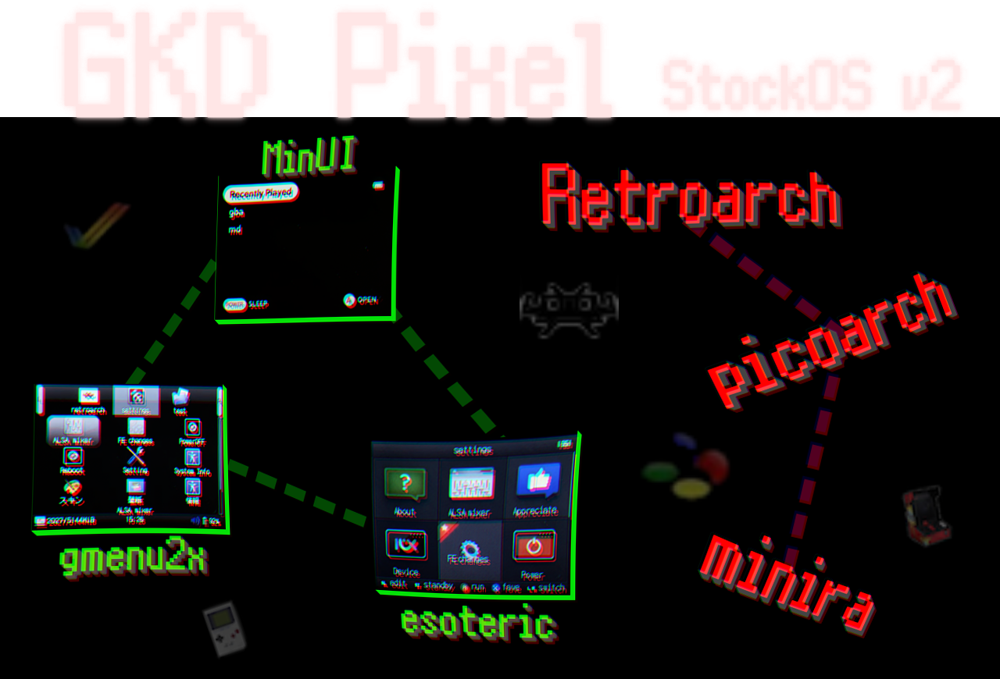

  

    

## 謝辞
各ソフトウエアの開発者ならびに私の作業をサポートしてくれた方々に感謝を申し上げます
- MinUI: https://github.com/shauninman/MinUI
- MinUI-Addons: https://github.com/retrogamecorps/GKD-Pixel-MinUI-Addons
- picoarch: https://git.crowdedwood.com/picoarch/
- Jutleys: https://www.rghandhelds.com/
- Rex: https://retrocn.com/  
And those who supported me...

## 英語での説明文(Explanation in English)
[Click here for explanation in English](./README_EN.md)

## はじめに
StockOSをベースに新しい機能を追加させました。  
なおこのOSイメージには日本の法律に従い、BIOSやROMファイルは含まれていません。  

## 新機能
- 3つのフロントエンドを切り替えることが可能
  - esoteric
  - gmenu2x
  - MinUI
- 3つのlibretroフロントエンドを切り替えることが可能(esotericとgmenu2xで有効)
  - Retroarch
  - picoarch
  - minira
- 90個以上のlibretroコアを追加
  - [コアリストはこちら](./asset/sc01.png)
- JELOSと同じROMディレクトリ配置に変更
- esotericとgmenu2xのtestセクションを削除してemulatorsセクションに統一
- picoarchでスナップショットを撮るとサムネイル化が可能

# 既知の問題
## retroarchの問題
- フルスクリーンにならない
- vsyncが利用できずティアリングが発生する
- 解像度が高いコアは画面が正しく描写されない

## picoarchの問題
- ROMファイルがzipの場合、zipファイル内に複数のファイルがあるとエミュレータが実行に失敗する可能性がある

## MinUI
- 独自のROMディレクトリを参照している

## 全体的な問題
- 全てのlibretroコアの動作確認が取れていない
- サウンドが途切れる場合がある
- ティアリングが発生する場合がある
- USB接続で既存のファイルを上書きしや更新した場合に反映されない
  - OSの再起動で変更が反映される
  - 新規ファイル追加・削除は動作に問題ない
- USB機器が利用できない
  - キーボードやWiFiドングルなど

# フロントエンドの切り替え手順
esotericおよびgmenu2xでは”settings”セクションにある"FE changes"を実行してください。  
MinUIから切り替える場合は"Tools"の中にある"Revert Stock"を実行してください。  

# ファイルパス一覧
## ROMディレクトリ
[ROMディレクトリのファイルパス一覧はこちら](./ROMDIRS.md)

## フロントエンド
[フロントエンドのファイルパス一覧はこちら](./FRONTENDDIRS.md)

## エミュレーター
[エミュレーターのファイルパス一覧はこちら](./EMUDIRS.md)  
[エミュレータの追加手順はこちら](./ADDEMU.md)
# 開発者向け情報
[開発者向けの情報はこちら](./DEVINFO.md)

以上